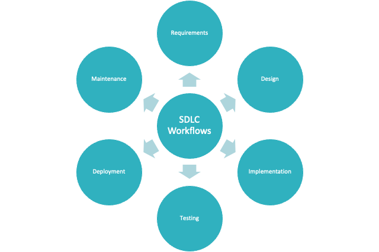
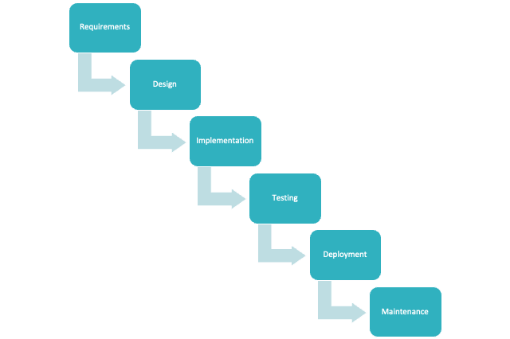
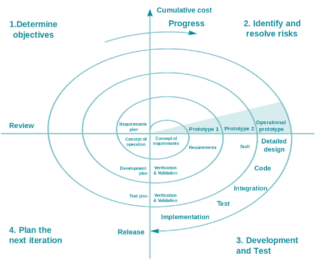
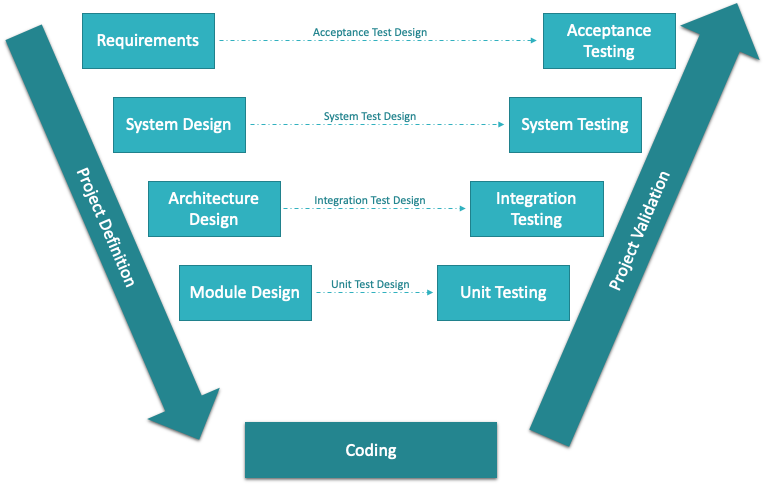
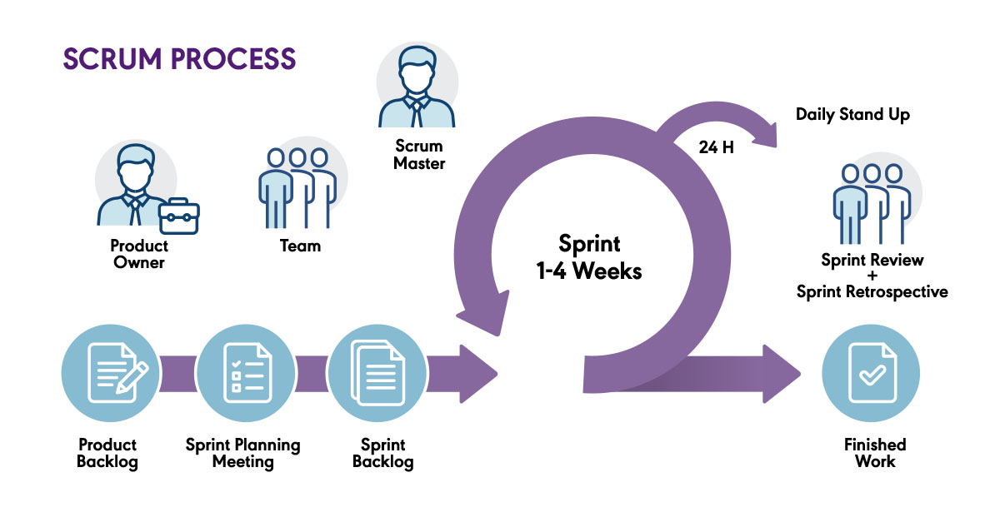

# Learning Corner 1

## Core Workflows

There are 6 core workflows (see Fig. 1) in any software development lifecycle model:

### 1. Requirements

The _requirements_ workflow typically encompasses two activities: _requirements capture_ and _requirements analysis_. Requirements capture is the process of discovering and documenting requirements. Requirements analysis is the process of ensuring the correctness and feasibility of the requirements.

**Inputs** to the _requirements_ workflow include everything that tells the team what it will need to do and build:

* Customer requests
* Market research
* Expert advice
* Bug reports (if this is performed after some of the software is already built)

**Output** of the requirements workflow include:

* Software Requirements Specifications (typically for plan-driven SDLC models)
* Use Cases (for iterative/evolutionary SDLC models like UP)
* User Stories (for Agile SDLC models like Scrum)
* Business domain documentation that describes the business the client intends to use software for in the vocabulary of that business

Grady, et. al. (1998) define the _requirements capture_ as the following steps:

> * List candidate requirements.
> * Understand system context.
> * Capture functional requirements.
> * Capture non-functional requirements. (p. 114)

Regarding _requirements analysis_, Grady, et. al. (1998) write:

> In analysis, we analyze the requirements as described in requirements capture by refining and structuring them. The purpose of doing this is to achieve a more precise understanding of the requirements and to achieve a description of the requirements that is easy to maintain and that helps us give structure to the whole system - including its architecture. (p. 173)

### 2. Design

_Design_ is the process of converting your analysis of requirements into a technical blueprint that can be implemented.

**Inputs** to this workflow include:

* Outputs of the Requirements workflow
* Expert advice from people like software engineers, software architects, systems administrators, database administrators, and user interface/user experience experts
* Interface specifications from owners of systems the product will integrate with

&#x20;**Outputs** typically include:

* Diagrams showing how code modules will be built and connected
* Interface design documents showing how the system will connect to other systems
* Wireframes depicting user interfaces (i.e., screens)
* Database schemas and models showing how data will be structured and stored
* Plans for ensuring non-functional requirements are met (non-functional requirements include traits like scalability, maintainability, availability, recoverability, response times, and accessibility)

Looking to Grady, et. al. (1998) again, they write:

> In design, we shape the system and find its form (including its architecture) that lives up to all requirements -- including all nonfunctional requirements and other constraints -- mode on it. (p. 215)

### 3. Implementation

_Implementation_ is the process of actually building the system. This includes deploying servers, creating and deploying databases, writing code, deploying cloud infrastructure, installing and configuring software utilities (e.g., message queues, log aggregators, load balancers, and firewalls), and much more.

Grady, et. al. (1998) put it a bit more succinctly:

> In implementation, we start with the result from design and implement the system in terms of components, that is, source code, scripts, binaries, executables, and the like. (p. 267)

**Inputs** to this workflow include outputs of the Design workflow and the expertise of technically skilled workers.

**Outputs** of this workflow include:

* Source code
* Configured software applications and servers ready to be tested
* Technical documentation

### 4. Testing

_Testing_ is the workflow that verifies what was implemented is what was requested. Put another way, it is the _quality assurance_ of software development that ensures the product built by the team satisfies the requirements.

IEEE Standard 610.12-1990, "IEEE Standard Glossary of Software Engineering Terminology" defines _testing_ as:

> The process of operating a system or component under specified conditions, observing and recording the results, and making an evaluation of some aspect of the system or component.

Copeland (2008) provides a much shorter and simpler definition:

> At its core, testing is the process of comparing "what is" with "what ought to be." (p. 2)

**Inputs** to the Testing workflow include:

* Outputs of the Requirements workflow
* Outputs of the Implementation workflow (the product ready to be tested)
* Outputs of the Design workflow (diagrams, schematics, wireframes, and more)

**Outputs** of the Testing workflow include:

* Test results
* Pass/fail metrics
* Bug tickets

### 5. Deployment

Finally, the best part of the entire SDLC: _deployment_!&#x20;

I could not say it better than Naor (2020):

> Go take your solution and use it. Launch. Go Live.
>
> Get the stakeholders from phase one to use your software in the wild. Celebrate. Start measuring sales engagement.

**Inputs** to the Deployment workflow include:

* Outputs of the Design workflow
* Outputs of the Implementation workflow

**Outputs** of the Deployment workflow include the functioning system ready for use by the customer, release notes, user manuals, and training.

### 6. Maintenance

_Maintenance_ involves keeping the product running smoothly in production for your customers. This also includes gathering feedback from customers, logging bugs, documenting new feature requests, making backups, security patching, and more.

While Naor (2020) groups this workflow in with the _deployment_ workflow, _maintenance_ can be reasonably viewed as its own phase. This is particularly true when following an Agile SDLC model because it occurs concurrently with all the other workflows.

**Inputs** of the Maintenance workflow include:

* Outputs of the Design workflow
* Outputs of Deployment workflow
* Service level agreements
* User/client feedback

**Outputs** of the Maintenance workflow include:

* Helpdesk and Support
* Patching and updates
* Bug reports
* New feature requests

## Predominant Software Lifecycle Models

Software Lifecycle Models organize these 6 workflows into a logical plan to be executed by a team. In other words, they define in what order and how many times these workflows are performed. SDLC models are important because they organize the efforts of multiple people into a constructive march toward a single goal.

This short video (see Vid. 1) explains what Software Development Lifecycle models are and covers a few examples:


Vid. 1: What is a Software Development Lifecycle?


There are a few prevailing models you may encounter in your career:

* Waterfall
* V Model
* Spiral Model
* Agile (comes in many different "flavors" -- Scrum, Extreme Programming, Kanban, Lean, etc.)

### Linear Sequential Model (Waterfall)

In some models, the core workflows are executed once from start to finish (linear) and in a specific order (sequential). Hence, the _Linear Sequential Model_ (see Fig. 2)_,_ which is also called _Waterfall_. At the end of these models, you have your product exactly as it was defined by the requirements at the beginning. Because all the planning is performed at the start of the project, this model is highly prone to error and does not suffer unexpected changes well. Furthermore, there is little client involvement after the requirements workflow completes. Often, clients do not really know what they need until they start to see the development team's efforts at building it. Software development is a dance between the team and the client and is only successful if both parties participate.

### Spiral Model

In other models, a series of formalized steps are executed _iteratively_. The _Spiral_ model (see Fig. 3), for example, repeats 4 phases _iteratively_ to build a larger and more complete product _incrementally_. Because requirements and risks are continually analyzed (rather than being defined up-front), this is also an _evolutionary_ model. The _Spiral_ model also recommends that a Prototype precede the actual implementation of new features. This prototype is not free and likely results in a significant cost increase. The _Spiral_ model typically has long iterations (measured in months) and places a high emphasis on risk. Heavy planning takes place at the start of each iteration and requirements for that iteration are thoroughly documented. The _Spiral_ model relies heavily on planning and does not react well to sudden changes.

### V-Model

The _V-Model_ (see Fig. 4) is a slight variation on the _Linear Sequential (Waterfall)_ model.&#x20;

On the download slope of the _V-Model_, increasingly technical plans are made and documented. These start at the overall _requirements_ level (what does the customer want) and end with individual code modules being designed. In parallel with these planning exercises, the tests that will eventually confirm these plans were properly implemented are being designed and written.&#x20;

At the bottom of the V, the designs are implemented in code and infrastructure.

Finally, on the upward slope of the _V-Model_, increasingly broader perspectives of the system are tested and validated. This starts with units of source code and ends with the user exercising the system and passing judgment on it.

Because the _V-Model_ is only a fancy variation on the _Waterfall_ model, it suffers the same issues. All the planning is done up front leaving it highly vulnerable to unexpected requirements changes, bugs found late in the project, and a long period of radio silence between the development team and the customer.

### Agile

All of the models discussed above can be classified as "plan-driven." _Waterfall_ is often considered the classic approach to managing a software project (Cobb, 2015), but, over the past couple of decades, software teams have moved toward progressively more "_agile_" methodologies.

There is no single definition for _agile_, but a good place to start is by looking at its origin, the _Agile Manifesto_:

> We are uncovering better ways of developing\
> software by doing it and helping others do it.\
> Through this work we have come to value:\
>
>
> **Individuals and interactions** over **processes and tools**\
> **Working software** over **comprehensive documentation**\
> **Customer collaboration** over **contract negotiation**\
> **Responding to change** over **following a plan**\
>
>
> That is, while there is value in the items on\
> the right, we value the items on the left more.
>
> (Beck K, Beedle M, Bennekum A, et al., 2001)

To get the best idea of what it means to be _agile_ in the software development context, study the middle paragraph. You will notice it is divided in half such that the left side contains traits we want to maximize and the right side contains trait we want to minimize.

TL;DR -- maximize communication; eliminate tasks that add little or no value; and, be flexible.

Watch this short video (see Vid. 2) that identifies some of the most valuable differences between _agile_ and plan-driven approaches to software development.


Vid. 2: This is Agile: A Brief Explanation of Agile


_Scrum_ is the leading "flavor" of _agile_ and is what you will learn throughout this course. Figure 5 shows the basic _Scrum_ process.

Scrum maintains a _product backlog_ of requirements that is refined and "groomed" continuously for the life of the project. This means the requirements will never be fully captured or documented. Scrum is performed as a series of short, time-boxed sprints. At the end of each sprint, the team should have something deployable to show for their work. Because sprints are normally one to four weeks in length, this deployable feature may be very small, but it should at least work.

Before starting each sprint, the team selects enough items from the _product backlog_ to keep itself busy for the full sprint; however, it also strives to not overcommit itself. The team wants just enough work for that sprint. The selected items go into the _sprint backlog_ and members pull their tasks from that for the duration of the sprint.

_Agile_ (and _Scrum_) differ from the other models (above) in that it operates as an indefinite series of short, high-intensity iterations (sprints); it does not attempt to define all requirements up front; it strives to produce something functional by the end of every sprint; because requirements aren't fixed and it keeps iterations short, change can be easily accommodated; and, it involves the client early and often. _Agile_ makes many other improvements that you will cover later in the course.

Finally, one of the most noticeable differences between _Agile_ and the previous models is that _Agile_ performs all of the Core Workflows in parallel, nearly all the time. During Sprints, the team is constantly analyzing requirements, designing solutions, implementing solutions, testing implementations, deploying the deliverables at the end of the Sprint, and maintaining the production environment. The clean separation of workflows found in sequential models gets thrown out the window by _Agile_.

## References

* Beck, K., Beedle, M., Bennekum, A. van, Cockburn, A., Cunningham, W., Fowler, M., Grenning, J., Highsmith, J., Hunt, A., Jeffries, R., Kern, J., Marick, B., Martin, R. C., Mellor, S., Schwaber, K., Sutherland, J., & Thomas, D. (2001). _Manifesto for Agile Software Development_. https://agilemanifesto.org/
* Cobb, C. G. (2015). _The Project Manager’s Guide to Mastering Agile_. Wiley.
* Copeland, L. (2008). _Practitioner’s Guide to Software Test Design, A_. Artech House.
* Naor, A. (2020, September 30). _What is SDLC? Software Development Life Cycle Phases, Methodologies, and Processes Explained_. FreeCodeCamp. https://www.freecodecamp.org/news/what-is-sdlc-software-development-life-cycle-phases-methodologies-and-processes-explained/
* Jacobson, I., Booch, G., & Rumbaugh, J. (1998). _Unified Software Development Process, The_. Addison Wesley Longman, Inc.
* _SDLC Tutorial_. (n.d.). Tutorials Point. Retrieved July 11, 2022, from https://www.tutorialspoint.com/sdlc/index.htm#
