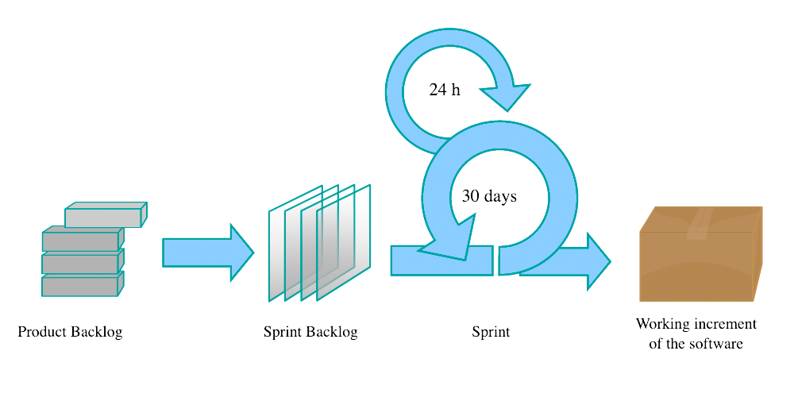

# Learning Corner 3

## What does a Product Owner do?

Mike Cohn (2009), the founder of Mountain Goat Software (a major provider of Scrum training), writes that a Product Owner has two primary directives:

* Provide vision
* Provide boundaries

### Provide Vision

We touched on _vision_ last week as a part of the Agile Team Charter. There, we defined _vision_ as "the value the project intends to deliver its customers."

The Product Owner's responsibility of "providing vision" goes far beyond a one or two-sentence entry into the Team Charter, however. The Product Owner must provide a vision for the project that extends well into the future. In military terms, the Product Owner must provide not just a _tactical_ vision but, also, a _strategic_ vision.

With a vision defined, the Product Owner must sell it to the team. Cohn (2009) provides a compelling explanation, "The best teams are those whose passion has been ignited by a compelling vision shared by the product owner" (p. 126). A good vision motivates the team and makes their work meaningful to them.

Finally, the Product Owner must clarify this vision by breaking it down into executable increments and eliminating any ambiguities. They do this in two ways:

1. Product Backlog: The Product Owner captures the executable increments in the form of User Stories and prioritizes them into a Product Backlog.
2. Being Available: The Product Owner is available to answer the team's questions, clarify areas of confusion, add detail, and, generally, convey the client's needs.

### Provide Boundaries

While it is the job of Product Owners to describe what the product must be, it is also their job to describe what it cannot be and, more generally, limit the team to options that satisfy the _iron triangle_ (see Fig. 1 below) from the client's perspective.

.png>)

The Iron Triangle illustrates the inseparable relationship between _scope_, _resources_ (i.e., people and money), and _time_. The bottom line is if you change one component (e.g., increasing scope with more features) you will unavoidably change another component (e.g., either you must drastically add resources, greatly extend the schedule, or, more likely, increase both to some degree).

It is the Product Owner's job to decide how to make these tradeoffs so that the eventual outcome best meets the client's needs. Product Owners do this by _setting boundaries_. Examples include: setting the deadline; adding and removing requirements; setting non-functional requirements (e.g., performance, reliability, platform compatibility, and scalability); deciding final deployment environment (e.g., a personal computer, a smartphone, or electromagnetic-shielded satellite components).&#x20;

All of these decisions create a box within which the team can engineer and implement their solutions. While this might sound uncomfortably confining, Cohn (2009) describes the arrangement like this:

> When brainstorming solutions to a challenging problem, common advice is to think “outside the box.” However, there is evidence that better solutions emerge more easily from thinking that is done “inside the box” as long as the box has been properly framed... The product owner’s job is to create the new box—the boundaries—in which the team will think. This new box prevents the team from getting lost in the infinitude of possible solutions and gives team members a basis for making and comparing choices. (p. 127)

## What Makes a Good Product Owner?

It takes certain skills and personality traits to be a good product owner. It is a stressful job in which you are constantly negotiating with multiple parties and are rarely able to satisfy them all.

Cohn (2009) lists five characteristics he believes are most important:

### Available

Teams rarely have spare time, and when they need a question answered about vague requirements or a needed change, they need it answered immediately. Good Product Owners are always available to the team.

### Business Savvy

Product Owners need to be experts on the product they own. If it's a banking system, for example, they need to deeply understand the banking domain and its business processes. Some of the best product owners formerly worked in the client's domain as marketing experts, product managers, or business analysts.

### Communicative

Product Owners act as the interface between multiple audiences that often have very different concerns. They must communicate with executives, clients, and the development team. This necessitates the ability to distill complicated information to its core element and convey that in a way multiple audiences comprehend.&#x20;

### Decisive

Project teams constantly encounter situations where they need to choose between several options when building a system. They don't have time for the Product Owner to go back to the client for an answer in every situation. This means good Product Owners need to be completely in tune with their client's needs and desires and willing to make decisions on their behalf.

### Empowered

Effective Product Owners must have the faith and confidence of decision-makers in their organization and of the client. When they make decisions about the project, those decisions must be supported by the people the Product Owner answers to. A micromanaged, subordinated, or distrusted Product Owner is useless to their team.

### And...Negotiation

One trait that Cohn did not list, but that is also very important, is the ability to **negotiate**. Product Owners often find themselves guiding two opposing parties through competing interests to find the middle ground. In most cases, these situations arise when drawing the boundaries discussed earlier (i.e., when adjusting the three sides of the _Iron Triangle_). Effective Product Owners can guide stakeholders through the process of making the necessary tradeoffs between time, resources, and scope so that their highest priorities are achieved on schedule without sacrificing quality.

## Story Time

### Traditional Requirements Documents

The tools and techniques used by teams to record product requirements differ based on the methodology used. Traditional, linear sequential methodologies frequently used comprehensive, wordy, and lengthy documents called Software Requirements Specifications (SRS). They consisted of hundreds or thousands of numbered "shall" statements.&#x20;

While extremely detailed, these documents were impractical and tended toward dissonance with the actual product. This disconnect between what is written in the SRS and what exists in the actual product creates a high cost (in resources and time) of keeping the document up-to-date. The SRS also suffered from the same _fatal conceit_ that dooms most linear sequential projects, believing the team could accurately and completely identify all requirements up-front.

Other methodologies and frameworks use "use cases" as their framework for documenting requirements. Use cases are an improvement over the SRS because each use case focuses on a much smaller portion of the overall requirements (e.g., a single feature or process flow). However, use cases are still far too verbose and detailed to be easily kept in sync with the actual system. Like the SRS, use cases suffer from the fatal conceit. Even though each use case focuses on a much smaller portion of the system, the practice of using use cases assumes one can identify all the requirements and details for that use case up-front.

 

The screenshots above show the first and second pages of a traditional use case template, compliments [TemplateLab.com](https://templatelab.com/use-case-templates/). Surprisingly, this template has not even been filled in; yet, it's already two pages long. You're welcome to download the actual Microsoft Word file:


File 1: Use Case Template


### An Agile Solution

By now, you're surely thinking, "There must be a better way." Not only is there a better way, there is a shorter, more intuitive, and more _agile_ way called _User Stories_.&#x20;

A User Story is a succinct, conversational description of a feature your client wants in the system. It normally includes:

* _the user story,_
* supporting details,&#x20;
* and acceptance criteria.

Ron Jeffries (2001), one of the founders of Extreme Programming flavor of Agile, provides a simple and memorable description of user stories:

> User stories have three critical aspects. We can call these _Card_, _Conversation_, and _Confirmation_.

#### Card

User Stories are written on _cards_. Historically, these were actual 3" x 5" (or similarly sized) index cards. Such a small medium serves as the perfect incentive to capture requirements in a _lean_ and _iterative_ manner, in keeping with the Agile philosophy. In fact, minimal documentation is one of the Agile manifesto values: "Working software over comprehensive documentation" (Beck et al., 2001).

There simply is not enough room to go into excessive detail, instead, you only have space for the main idea. This is perfect because the user story represents a need, not every possible detail about that need.

Jeffries (2001) explains:

> User stories are written on cards. The card does not contain all the information that makes up the requirement. Instead, the card has just enough text to identify the requirement, and to remind everyone what the story is. The card is a token representing the requirement. It’s used in planning.&#x20;

#### Conversation

The lack of detail within a user story encourages the developers and testers to have conversations with the product owner or client for more information. These conversations follow the Agile Manifesto's values of "Customer collaboration over contract negotiation" and "Individuals and interactions over processes and tools" (Beck et al., 2001).

Jeffries (2001) describes this process:

> The requirement itself is communicated from customer to programmers through conversation: an _exchange_ of thoughts, opinions, and feelings.

Ideally, as part of these conversations, you get what Jeffries calls "supplements." Often, these may be documents defining business processes, interfaces, sketches, or other helpful information. In the _best cases_, they are _examples_. The best examples describe how the user needs the system to operate (i.e., they are executable). Executable examples become _acceptance criteria_ that you can include in your user story. Acceptance criteria are directly transferrable into your test scripts.

#### Confirmation

This final piece of the user story puzzle is where your acceptance tests confirm that the implementation satisfies its acceptance criteria. Without _confirmation_, such a simple approach to requirements management would not be possible.

In summary, the _card_ concisely states what needs to be done, the developers and testers have _conversations_ with the product owner to get the details, and the _confirmation_ verifies the implementation satisfies those details.

### Writing User Stories

User Stories should adhere to some simple requirements:

* they are written from the perspective of your users;
* unlike traditional requirements, they put people first;
* they use your user's vocabulary (domain language);
* they are written for a specific user role (persona);
* they are broken down into an "atomic" unit of work (can be accomplished in a single sprint); and,
* clearly define the "definition of done" (acceptance criteria).

Rehkopf (n.d.) provides one of the most common formats for user stories:

> “As a \[persona], I \[want to], \[so that].”

There are three main parts (see Fig. 4 above):

* **Persona:** this is the role of the user while they execute the user story (e.g., administrator, teacher, student, accountant, warehouse manager, cashier, customer, player)
* **Want to:** this is the action/task the user should be able to do after the user story is implemented
* **So that:** this is the impetus/need/context that explains why the user wants to perform this story -- this piece is deceptively important because context often drives your decision about how to implement a feature

Here are some examples of user stories written in this format -- borrowed from Rehkopf (n.d.):

* As an electrical engineer, I want to model the use of common multiplexers in my electrical circuitry diagrams so that I don't have to manually model these smaller circuits.
* As a patient admittance nurse, I want to load patients' vitals (height, weight, blood pressure, temperature, and O2 saturation) directly into their charts via Bluetooth sensors so that I can do my job faster and without human error.
* As a vacation planner, I want to search flights, hotels, and rental cars based on more eccentric characteristics like mixed drinks available on flights, food available near the hotels, and brands and models of rental cars available so that I can more closely tailor my experience to my preferences.

### Tips for Writing Great User Stories

Mike Cohn (2004) provides some more tips on writing effective user stories (p. 17).

#### **Independent**

Stories should not depend on other stories (Cohn, 2004, p. 17). It is not always possible to avoid dependencies, but it is a worthy goal. Dependencies force you to prioritize and order stories. Independent stories can be implemented in any order and allow smooth parallelization of effort.

#### **Negotiable**

This trait derives from the _conversation_ component of user stories we discussed above. User stories serve as reminders to have a conversation with the product owner or client (Cohn, 2004, p. 18). This means we don't add in all the details upfront and, instead, negotiate and discuss the details just in time. Too many details upfront act as a contract and stifle conversation and collaboration.

#### Valuable to Your Client and/or Users

Developers often forget that user stories are written from the users' perspectives using the users' domain language. A user story that reads, "The frontend will maintain a WebSocket connection to the backend and communicate using the STOMP protocol" is absolutely meaningless and useless to users.&#x20;

In Agile, it is the Product Owner who prioritizes user stories and grooms the backlog. Product Owners will be unable to do that job if they cannot understand the user stories. The best way to ensure user stories are valuable to your client and users is to have those people write them (Cohn, 2004, p. 21). In the case of Scrum, have the Product Owner write the stories.

#### Estimable

Cohn (2004) writes, "It is important for developers to be able to estimate (or at least take a guess at) the size of a story or the amount of time it will take to turn a story into working code" (p. 22). He goes on to mention that some of the most common reasons stories cannot be estimated include:

* **Developers lack domain knowledge.** This usually means developers don't understand their client's business (e.g., your client is an accountant and you don't understand double-entry ledger systems).
* **Developers lack technical knowledge.** In this case, the developers need to use a technical solution that they don't understand (e.g., your client requires a categorization machine-learning algorithm to classify customer e-mails by mood and no one on your team has done this before).
* **Too big.** If a user story is too broad in scope, it cannot be estimated. In some cases, it may be reclassified as an epic that encompasses many smaller stories. In other cases, it may simply be decomposed into smaller, individual user stories.

#### Testable

A user story must have a definition of done that can be empirically proven. As Cohn (2004) mentions, untestable user stories often crop up when dealing with _nonfunctional_ requirements. Nonfunctional requirements are those that impose constraints on the qualities of a system rather than its behaviors.

Examples of untestable user stories include:

* The web page loads quickly.
* The user interface is intuitive.
* The system is fault tolerant.

All three of these examples could be made testable by adding a numeric quantifier to them. For example:

* The main page loads in 300 milliseconds over a 1Mbps Internet connection in 95 out of 100 test executions.
* 80% of generic users are able to complete their primary tasks in 5 minutes with no external help.
* The system has a Mean Time to Recovery of 20 minutes.

## Putting Things in Order with a Backlog

A _backlog_ in Scrum is an ordered (i.e., prioritized) list of user stories to be implemented by the team. There are two kinds of backlogs in Scrum:

* Product Backlog
* Sprint Backlog

### Product Backlog

#### What is a Product Backlog?

According to _The Scrum Guide_ (Schwaber, K. & Sutherland, J., 2020), the _Product Backlog_ is "an emergent, ordered list of what is needed to improve the product. It is the single source of work undertaken by the Scrum Team."

In short, **it is** the prioritized list of all _known_ user stories. It **is not** the definitive, all-encompassing list of everything that must be done to finish the product; and, it cannot be seen as a simple roadmap that, once followed, leads to a completed and delivered product.

Jeffries (2015) explains many Scrum teams fall victim to a logical trap by viewing the Product Backlog as "a master list of every single change that will be made in creating the product, each item including a description, priority, and estimate."

#### Commitment: Product Goal

A product is never truly "complete" until it is retired. Even after deployment (or delivery), a product still undergoes maintenance. This means the software development team needs some "Definition of Done" by which they can gauge their progress towards the end of the project. In Scrum, this is called the **Product Goal**. In other words, the Product Goal describes the value the Scrum Team hopes to deliver by creating the product.

> The Product Goal describes a future state of the product which can serve as a target for the Scrum Team to plan against. ... The Product Goal is the long-term objective for the Scrum Team. They must fulfill (or abandon) one objective before taking on the next. (Schwaber, K., & Sutherland, J., 2020)

#### The Product Owner and the Product Backlog

The _Product Owner_ is responsible for maintaining the _Product Backlog_. They must regularly _groom_ the Product Backlog by revising existing user stories, adding and removing stories, and ensuring all the stories are prioritized in a way that delivers the most value to the client.

Cobb (2015) describes the importance of backlog grooming:

> Grooming is an important part of any agile project, but it is often overlooked and not planned for as much as it should be. A good technique is for the project team to allocate some time in each sprint so that the queue of stories to be developed never runs empty. (p. 70)

### Sprint Backlog

#### What is a Sprint Backlog?

Where the _Product Backlog_ is a list of user stories needed to improve (or deliver) the product, the _Sprint Backlog_ is a list of user stories selected by developers that they believe they can complete within a single sprint. These user stories are selected from near the top of the prioritized _Product Backlog_ so that the stories most important to the Product Owner (and client) are completed first.

The _Sprint Backlog_ is not set in stone; developers can negotiate its scope with the Product Owner, even during the Sprint. It is also updated throughout the Sprint. As developers learn more while working, they should update the user stories in the _Sprint Backlog_ with details.

#### Commitment: Sprint Goal

Just as the _Product Goal_ serves as the "Definition of Done" for the project, the _Sprint Goal_ serves as the "Definition of Done" for a Sprint.&#x20;

> The Sprint Goal is the single objective for the Sprint. ... The Sprint Goal also creates coherence and focus, encouraging the Scrum Team to work together rather than on separate initiatives.  (Schwaber, K., & Sutherland, J., 2020)

In practice, the _Sprint Goal_ serves as a common theme shared by the user stories selected for a Sprint. Perhaps, they all contribute toward some larger feature or focus on a specific user role.

#### The Product Owner and the Sprint Backlog

Product Owners play a large role in setting the _Sprint Goal_. They choose a theme (or focus) of the Sprint while developers set the scope (how much work can realistically be done). Together, the Product Owner and developers negotiate the final _Sprint Goal_, which serves as that Sprint's "Definition of Done."

Just like the _Sprint Backlog_, the _Sprint Goal_ is a flexible part of Scrum. Even after the Sprint has started, the developers and Product Owner may revisit the _Sprint Goal_ based on their discoveries.

> As the Developers work during the Sprint, they keep the Sprint Goal in mind. If the work turns out to be different than they expected, they collaborate with the Product Owner to negotiate the scope of the Sprint Backlog within the Sprint without affecting the Sprint Goal. (Schwaber, K., & Sutherland, J., 2020)

## References

* Aljaber, T. (n.d.). _Iron Triangle Project Management | Atlassian_. Atlassian Agile Coach. Retrieved July 27, 2022, from https://www.atlassian.com/agile/agile-at-scale/agile-iron-triangle
* Beck, K., Beedle, M., Bennekum, A. van, Cockburn, A., Cunningham, W., Fowler, M., Grenning, J., Highsmith, J., Hunt, A., Jeffries, R., Kern, J., Marick, B., Martin, R. C., Mellor, S., Schwaber, K., Sutherland, J., & Thomas, D. (2001). _Manifesto for Agile Software Development_. https://agilemanifesto.org/
* Cobb, C. G. (2015). _The Project Manager’s Guide to Mastering Agile_. Wiley.
* Cohn, M. (2004). _User Stories Applied: For Agile Software Development_. Addison-Wesley.
* Cohn, M. (2009). _Succeeding with Agile: Software Development Using Scrum_. Addison-Wesley.
* Jeffries, R. (2001). _Essential XP: Card, Conversation, Confirmation_. https://ronjeffries.com/xprog/articles/expcardconversationconfirmation/
* Jeffries, R. (2015). _The Backlog_. https://ronjeffries.com/articles/015-10/the-backlog/article.html
* Rehkopf, M. (n.d.). _User Stories_. Atlassian Agile Coach. Retrieved August 1, 2022, from https://www.atlassian.com/agile/project-management/user-stories
* Schwaber, K., & Sutherland, J. (2020). _The Scrum Guide: The Definitive Guide to Scrum: The Rules of the Game_.
