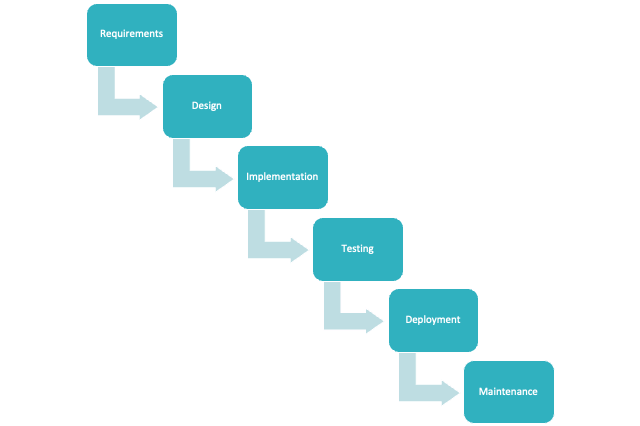

# Learning Corner 5

## What is an Agile Tester?

Crispin and Gregory (2017) define this role as, "_a professional tester who embraces change, collaborates well with both technical and business people, and understands the concept of using tests to document requirements and drive development" (p. 19)._

To clarify, an Agile Tester is a tester who is a fully integrated member of the Agile Team, is equally responsible for the success of the project, collaborates well with both the team and customers, is technically capable, and understands his role in capturing and verifying requirements by writing and executing test cases.

## What does an Agile Tester do?

Testers validate software. They ensure it does what it is supposed to do _and_ that it does it correctly. Using Agile terminology, testers validate that the software satisfies the acceptance criteria of completed user stories.

Do not confuse developers' responsibility to write unit tests with testers' responsibility to validate acceptance criteria with acceptance tests. Acceptance-Test-Driven Development is a whole team methodology while Test-Driven Development is a developer methodology.&#x20;

Remember that the distinction above does not imply a siloed approach to testing! Crispin and Gregory (2011) write, "**Everyone on an agile team is a tester. Anyone can pick up testing tasks.**"

Cobb (2015) clarifies the distinction between developers' TDD and the whole teams' ATDD:

> _Test-driven development is done at the level of unit testing to validate the implementation of code, while acceptance test-driven development is done at a higher level of functional testing and tests the features and behaviors of the system that are observable by the user._
>
> _Acceptance test-driven development involves writing the acceptance tests for the functionality that must be provided in each story prior to starting development. This is usually done as part of the writing or grooming of the stories, and it helps to build a more concise, common understanding of exactly what needs to be done to satisfy the user need for each story. (p. 80)_

The quote above by Crispin and Gregory begs the question, "If everyone is a tester, then what do designated _Agile Testers_ do?" Thankfully, the two authors answered this question for us:

> _We define an agile tester this way: a professional tester who embraces change, collaborates well with both technical and business people, and understands the concept of using tests to document requirements and drive development. Agile testers tend to have good technical skills, know how to collaborate with others to automate tests, and are also experienced exploratory testers. They’re willing to learn what customers do so that they can better understand the customers’ software requirements._
>
> _Who’s an agile tester? She’s a team member who drives agile testing. (p. 19-20)_

## What makes an Agile Tester different from traditional testers?


This list is not all-inclusive. The three characteristics discussed below are a few of the most important differences between Agile and traditional testers but are certainly not the only ones.


### Whole-Team Approach

First, in non-Agile linear-sequential models (like Waterfall) or iterative models (like Evolutionary Prototyping), Testers were treated as _gatekeepers._ If they did not bless off on a release in Waterfall, it was not released. If they did not bless off on an iteration in Evolutionary Prototyping, the project would not progress to the next iteration.&#x20;

On an Agile Team, instead of being a gatekeeper, "_Testers collaborate with programmers, the customer team, and other team specialists—and not just for testing tasks, but other tasks related to testing, such as building infrastructure and designing for testability"_ (Crispin & Gregory, 2011, p. 15).

Second, this collaboration results in another benefit offered by Agile teams: everyone on the team is responsible for testing. This leads developers to think about the _testability_ of their code. Testable code almost always follows the SOLID principles better than code written without testability in mind. Test Driven Development encourages developers to strive for these principles because unit testing object-oriented code requires the SOLID principles to be present, especially when mocking is going to be used.

The flow often looks like this:

<figure><figcaption>
Fig. 1: From Conversations to Code
</figcaption></figure>

Another significant benefit of the whole team approach is that testers may require help from other team members to build and perform tests. Crispin and Gregory (2011) describe this symbiosis like this:

> _As a tester on an agile team, you’re a key player in releasing code to production, just as you might have been in a more traditional environment. You might run scripts or do manual testing to verify all elements of a release, such as database update scripts, are in place. All team members participate in retrospectives or other process improvement activities that might occur for every iteration or every release. The whole team brainstorms ways to solve problems and improve processes and practices. (p. 14)_

The duties of an Agile Tester go beyond testing. Ghahrai (2017) lists these other responsibilities of Agile Testers that may not be immediately apparent. Notice that many of these overlap other traditional roles like System Administrator, Developer, Business Analyst, and Project Manager.

* Configuring, using, and managing test environments and test data
* Reporting defects and working with the team to resolve them
* Coaching other team members in relevant aspects of testing
* Participating proactively in daily standup meetings, story grooming sessions, team retrospectives, suggesting and implementing improvements
* Measuring and reporting test coverage across all applicable coverage dimensions
* Ensuring proper use of testing tools
* Writing and executing automated checks and reporting back to the team
* Ensuring the appropriate testing tasks are scheduled during release and iteration planning

### Just-in-Time Testing

Unlike teams using other SDLC methodologies, Agile teams capture requirements, write test cases, and build software _just-in-time_. _Figure 1_ captures the lean, just-in-time nature of this process. Crispin and Gregory (2011) write:

> _Rather than creating tests from a requirements document that was created by business analysts before anyone ever thought of writing a line of code, someone will need to write tests that illustrate the requirements for each story days or hours before coding begins. (p. 13)_

This _just-in-time_ approach also applies to executing the tests. Agile delivers increments, or iterations, of the product rather than the system as a whole at the end of the project. It only makes sense that Agile Testers test each increment as soon as, or even before, its coding is completed.

### Proactive

Agile Testers are proactive in their jobs. This trait is closely related to the _Whole-Team Approach_ trait discussed above. Teams following linear-sequential SDLC models typically operate in a silo, with members focusing solely on duties that fall under their roles.&#x20;

<figure><figcaption>
Fig. 2: Waterfall Model
</figcaption></figure>

_Figure 2_ (above) depicts the traditional _Waterfall_ model. In a siloed approach to work,&#x20;

* _Business Analysts_ would execute the _Requirements_ phase;
* _Architects_ and _Lead Developers_ would perform the _Design_ phase;
* _Developers_ would perform the _Implementation_ phase;
* _Testers_ would perform the _Testing_ phase;
* _System Administrators_ would perform the _Deployment_ phase;
* and the process would repeat to address any maintenance issues.

The problem with this approach is it leads team members to only take responsibility for their stage of the process. This is an antithesis of the _Whole-Team Approach_ and the idea that everyone is responsible for the project's success. Once members complete the work specifically related to their role, they toss their work product over the wall and forget about it.&#x20;

<figure><figcaption>
Fig. 3: Siloed Teams Toss Work over "the Wall"
</figcaption></figure>

Members of an Agile team (and Agile Testers) proactively seek ways to support their team members, even when that work does not fall under the duties of their role. A great example of this is Testers helping developers understand user stories and adequately cover edge cases with their unit tests. On the flip side, Developers often support Testers when they are writing and building automated functional tests. One final example of this practice is Developers lending support to System Administrators with building deployment environments or automating the deployment process. On a final note, the practice of _Swarming_ epitomizes the _proactive_, _Whole-Team_ mindset.

## What does an Agile Tester do?

Agile Testers do a lot more than writing and executing tests. First and foremost, they _Live the Agile Values_. Writing and executing tests are just one strategy Agile Testers employ to live up those values.

### Live the Agile Values

Agile Testers _do not_ act as "quality assurance gates." Their job is not to block deployments that fail to meet some threshold. In Agile, the customer decides whether a Sprint satisfies its _Sprint Goal_ sufficiently enough for deployment.&#x20;

Instead, Agile Testers help the customer express their requirements, support the team ensure they correctly interpret and implement requirements, verify that the application satisfies the requirements, and consistently seek to deliver the best possible product. Obviously, Agile Testers do a lot of test writing and test execution, but they see these activities as a way of living up to the Agile values, not as the entirety of their jobs.

### Write and Execute Tests

In _Figure 4_ (below), the various kinds of tests and testing are divided into four quadrants based on their form of execution (functional or code/tool) and whether they provide most of their value to the team or the customer. For example, exploratory tests are performed by using the end product (not writing code or using advanced tools), and they deliver most of their value to the customer by ensuring a quality product. Conversely, unit tests are performed by writing code that exercises the product's code, and they deliver most of their value to the Agile team by giving the developers the confidence to refactor existing code.

<figure><figcaption>
Fig. 4: Agile Testing Quadrants (Crispin &#x26; Gregory, 2011, p. 98)
</figcaption></figure>

While Agile Testers normally stay out of Q1 and focus on the other quadrants, it is not uncommon for other team members to support the testers as they address Q2, Q3, and Q4. Agile Testers will almost always need help from Developers and System Administrators with preparing test environments, generating bodies of test data, providing compiled executables, maintaining CI/CD pipelines, and more.&#x20;

## Agile Tester Tools and Practices

### Agile Tester Practices

Agile Testers regularly employ several practices to live the Agile values and improve the quality of the product. Several of these we have already addressed, but for the purposes of providing a definitive list, I will cover them again here.

#### Concurrent Testing

Agile Testers integrate testing with development in every sprint. This means they do not wait for developers to _throw_ their code over the silo wall. Instead, testers begin planning and writing their tests at the start of each sprint. As developers complete tickets, merge them into the master/main branch, and the CI/CD pipeline automatically deploys the changes to a DEV or TEST server, testers can start testing well before the end of the sprint.

#### Acceptance-Test-Driven Development

As described earlier, Test-Driven Development is performed by Developers during Unit Testing. Similarly, Acceptance-Test-Driven Development is performed by Testers to verify requirements from the higher perspective at which they operate.&#x20;

Cobb (2015) describes some of the advantages of following an Acceptance-Test-Driven approach rather than the formalized, dogmatic _Software Requirements Specification_ used by linear-sequential models in the past:

> _A big advantage of acceptance test-driven development is that it can eliminate the requirement for writing detailed functional specifications, it simplifies the requirements definition process, and it keeps everyone on the team clearly focused on the functionality that must be provided to satisfy the business need. (p. 80)_

#### Repeatable Tests and Automated Regression Testing

Repeatable Tests are those tests for which the team has a documented test script that can be repeated verbatim in the future. In the past, these were executed by humans. As a result, they were very costly and time-consuming to perform. Worse, they were subject to human error. This means the results could be influenced by the tester's imperfection, possibly yielding _false positives_ or _false negatives_.

Today, thanks to the widespread adoption of CI/CD pipelines, _Automated Regression Testing_ is a widespread and easily adopted practice. Every common programming language and most common application frameworks has a multitude of free options for building suites of automated regression tests. We will look at a few of these in this week's assignment.

#### Value-Driven and Risk-based Testing

Because it is impossible for a team to test every conceivable path through an application, Agile Testers must focus their efforts where they produce the most value. The two criteria a tester should consider when deciding how to spend their time are _value_ and _risk_.&#x20;

Here, value means the value a feature provides the customer. If a part of the system is rarely used or has many workarounds to achieve the same results, the tester should probably spend little time testing that feature. A simple _smoke test_ ensuring the feature works, in general, is probably enough.

Risk is also a very important consideration. Risk is defined as the intersection of _probability_ and _impact_ should a risk be realized. This means a tester should consider how likely to fail some part of the system is _and_ what impact that failure would have on the customer. This calculation's result determines the effort and time a tester should spend testing that feature.

Project Management resources often provide a _Risk Matrix_ as a tool to simplify this calculation. It allows you to rate risk on a scale from Low to High quickly.

<figure><figcaption>
Fig. 5: Risk Matrix
</figcaption></figure>

### Agile Tester Tools

Agile Testers should use tools that help them create test cases from User Story Acceptance Tests. Crispin & Gregory (2011, p. 156) list six tools you should consider. Five of these are discussed below. Additionally, two categories of automated testing tools are briefly discussed at the end.

#### Checklists

These are great options for ensuring things are not overlooked. Checklists can be maintained as part of a user story's ticket in a team's task management system. The list may start as an itemized form of the acceptance criteria. As the Product Owner elaborates on those requirements and the Developer implements them, additional items the tester should verify can be added to the list.

Another use for checklists is to enforce and document testing procedures. They remind the tester of steps they should perform on any user story, considerations they should make, data they should capture, and more. This form of a checklist is commonly used to perform reviews of SDLC outputs (e.g., requirements documents, code, test cases, test results, deployments, etc.)

#### Mind Maps

Mind Maps allow the team to expound on the basic acceptance criteria collaboratively. Software tools or simple whiteboards can serve as the medium. Regardless, you should always capture the resulting mind map. A good option is attaching a picture of it to an Epic or User Story ticket in your task management or requirements management system.

#### Spreadsheets

Spreadsheets naturally lend themselves as a medium for writing test suites. An Excel workbook, for example, can capture an entire test suite. The workbook captures the test suite, each spreadsheet captures a single test case, and each row captures a test step.

Spreadsheets also serve as an easy way to capture test input data. For example, you might ask your customer to provide many realistic data samples for testing purposes. They can easily enter that into a spreadsheet you later feed into your automated tests.

#### Mock-Ups

Mock-ups are one of the greatest tools an Agile Team can leverage. Human minds are wired to operate most effectively on pictures; thus, it is no surprise that a software team can more efficiently and effectively communicate requirements and designs using pictures. In fact, mock-ups are an option that should be considered at the beginning of every sprint to discover, analyze, and document requirements. They are one of the most effective means of bridging the gap in understanding between the software team and the customer.

Bush (2022) describes the value of mock-ups:

> Domain-Driven Design is a highly effective methodology for designing and building quality software that is consistent with the client's domain and correctly solves that problem. One of its fundamental practices is using an _Ubiquitous Language_ throughout the entire software development lifecycle. Developers, clients, and stakeholders share a common vocabulary when using an ubiquitous language...Using a visual model in both requirements development and solution design both encourages and smoothes the process of building that Ubiquitous Language. Elements of visualizations naturally constitute parts of the Domain Model and give all stakeholders a single frame of reference.

#### Flow Diagrams

Flow Diagrams are another visual tool that helps developers, testers, and customers communicate and capture requirements. They are particularly useful when analyzing complex business processes.

#### **Automated Tools for Testing Non-GUI Components**


Unit Testing is normally a developer activity, not an Agile Tester activity. As such, those tools will be omitted here.


Agile Testers are responsible for verifying requirements at an integrated level. This means they will most often perform tests confirming that a given input or action causes an expected output or reaction. They should also perform negative testing to confirm the application gracefully fails for certain scenarios. Finally, they will be asked to verify non-functional requirements (often called the "-ilities").

Functional tests of non-GUI components often take the form of API-testing today. While there are many, MANY API testing tools on the market, the leading option (at the time of this writing) is Postman. It is an excellent tool for debugging APIs as they are being developed and offers a full suite of features for automated functional testing. For more information, visit their site at [https://www.postman.com/](https://www.postman.com/).

Another common non-GUI area for testing is the command line interface. The CLI has grown in popularity over the past few years thanks to power users. CLI applications often serve as tools for very niche or specific areas. BATS (Bash Automated Testing System) is a popular tool for automating the functional testing of CLI applications: [https://github.com/bats-core/bats-core](https://github.com/bats-core/bats-core)

Finally, a less obvious area for testing is the database. It is common to find data-intensive functionality coded directly into the database. This makes sense in cases where you want to minimize network bandwidth usage and take advantage of the database engine's natural abilities to query its data. Because stored procedures, functions, and views represent application logic (only on the database), they should be tested, too. Most tools for database testing require the tester to write the tests using a programming language. Examples of these tools include SQL Test by Red Gate ([https://www.red-gate.com/products/sql-development/sql-test/](https://www.red-gate.com/products/sql-development/sql-test/)) and [Testcontainers.org](https://www.testcontainers.org/).

#### Automated Tools for Testing GUI Components

There are considerably more options for testing GUI Components. Your decision is mostly guided by what kind of GUI you intend to test (e.g., web, desktop, or something more extravagant).

Most web testing tools use a middle layer called a "web driver" as the interface by which they control the browser. These tools are often divided into two parts:&#x20;

* An IDE where testers design, debug, and test their test scripts
* and an executor that executes tests in an automated environment like a CI/CD pipeline.

Despite modern web testing tools' amazing user-friendliness, you will still need to understand how to use CSS and XPath selectors to precisely reference components in web pages.

Examples of leading web testing tools include:

* Rainforest QA: [https://www.rainforestqa.com/](https://www.rainforestqa.com/)
* Katalon: [https://katalon.com/](https://katalon.com/)

Desktop testing tools have considerably fewer options. Additionally,  you must ensure they support the desktop GUI framework you intend to test. A tool that works for Windows applications may not support MacOS or Linux applications.

Examples of leading tools include:

* Telerik: [https://www.telerik.com/teststudio/desktop-testing](https://www.telerik.com/teststudio/desktop-testing)
* SmartBear TestComplete: [https://smartbear.com/product/testcomplete/desktop-testing/](https://smartbear.com/product/testcomplete/desktop-testing/)

#### CI/CD

Continuous Integration/Continuous Delivery tools are at the end of this list because no matter what automated testing tools you choose, they should be integrated into a CI/CD pipeline. If you are not familiar with CI/CD pipelines, here is a brief video introduction:


Fig. 6: CI/CD and Test Automation


Finally, here's a quick video that demonstrates setting up an automated test using the Jenkins CI/CD tool:


Fig. 7: Jenkins CI/CD Test Automation


## References

* Bush, C. (2022, May 12). _Drawing to Discovery - by Clinton - Bytes & Beans_. Bytes and Beans Substack. https://bytesandbeans.substack.com/p/drawing-to-discovery
* Cobb, C. G. (2015). _The Project Manager’s Guide to Mastering Agile_. Wiley.
* Crispin, L., & Gregory, J. (2011). _Agile Testing: A Practical Guide For Testers And Agile Teams_.
* Ghahrai, A. (2017). _Agile Testing Mindset and the Role of the Agile Tester_. https://devqa.io/agile-testing-mindset-tester-role-agile-team/
