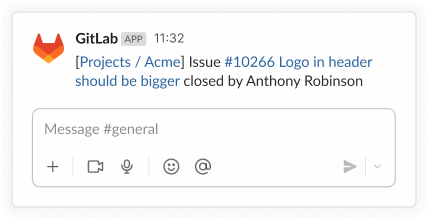

# Learning Corner 6

Any non-trivial Agile projects involve multiple people working on multiple tasks. To be effective, they need a way to coordinate and track their efforts. In the past (before the explosion of SaaS products and distributed teams), it was common to have physical Kanban boards in offices (see Figure 1).

<figure><figcaption>
Fig. 1: Pysical Kanban Board in Office
</figcaption></figure>
